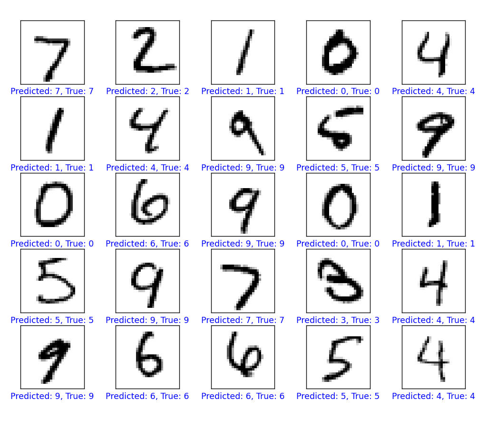

# Handwritten Digit Recognition Using Neural Networks

## Project Overview

This project develops a machine learning model to recognize handwritten digits using the MNIST dataset. The model is implemented in Python using TensorFlow and showcases the practical application of neural networks in image recognition.

## Installation

To run this project, you will need Python and several dependencies:

```bash
pip install numpy matplotlib tensorflow
```

## Running the Project

1. Clone the repository

```bash
git clone [repository-link from under the green "code" button above]
```

2. Navigate to the project directory:

```bash
cd NeuralNetworkForHandwrittenDigitRecognition
```

3. Run the script:

```bash
python main.py
```

## Model Architecture

The model is a simple neural network with the following layers:

- **Flatten Layer:** Converts the 2D 28x28 pixel images into a 1D array.
- **Dense Layer (ReLU Activation):** A fully connected layer with 128 neurons and ReLU activation. ReLU is chosen for its efficiency and ability to mitigate the vanishing gradient problem.
- **Dropout Layer:** Helps in reducing overfitting by randomly setting input units to 0 with a frequency of 20% at each step during training.
- **Output Layer** (Softmax Activation): A 10-neuron dense layer with softmax activation to classify the digits into one of the 10 categories (0-9).

## Training the Model

- **Epochs**: The model is trained for 5 epochs. This number provides a balance between computational efficiency and sufficient training for high accuracy.
- **Optimizer**: Adam optimizer is used for its effectiveness in handling sparse gradients and adaptive learning rate capabilities.
- **Loss Function**: Sparse categorical crossentropy is ideal for multi-class classification problems like this.

## Results

- The model achieved an accuracy of 97.66% on the test data after 5 epochs, indicating high efficiency in recognizing handwritten digits.

## Why These Choices?

- **Number of Epochs (5)**: A higher number of epochs did not significantly improve accuracy but increased computational time.
- **ReLU Activation**: Provides faster convergence and addresses the vanishing gradient problem, which is vital for deeper networks.
- **Dropout Layer**: Reduces overfitting, crucial for generalizing the model to new, unseen data.
- **Adam Optimizer**: Adaptive learning rate capability of Adam leads to faster convergence.
- **Sparse Categorical Crossentropy**: Suitable for multi-class classification where each sample belongs to exactly one class.
